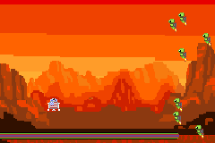

# Green River GBA Space Microjam!

A Game Boy Advance Microgame collection! Created by Green River College Software Development Cohort 23 students, led by Auberon López.

[Play it online here!](https://grc-cohort-23.github.io/microjam/)

Our class of students created a brand-new Game Boy Advance game together, 25 years after the release of the handheld! It is a WarioWare style microgame collection themed around outer space and UFOs.

## Playing the game

Recommended for most: [play it online!](https://grc-cohort-23.github.io/microjam/) Note that the web version may run slowly if your phone or computer is in power saving mode.

If you have an emulator or a physical Game Boy Advance with a flash cart, you can choose to [Download the ROM](https://grc-cohort-23.github.io/microjam/microjam.gba)

## Creation

This game was made as part of the SDEV 301 course in Green River College's Bachelor's in Software Development. For most students this was their first experience working in C++, and it was everyone's first time writing games for the Game Boy Advance! The first part of the quarter was spent learning the fundamentals of Systems Programming, Object-Oriented Design, and GBA development. We spent the last few weeks of the course putting this game together. Students worked in teams of two to create the graphics, code, and gameplay for their games. Some groups even made their own music and sound effects!

We got a class set of old Game Boy Advances, all bought used from GameStop. We also used EZ Flash Air cartridges which allowed us to put our prototypes on SD cards, and then play them on the original Nintendo hardware! We iterated, building our microgames bit by bit, and taking time in class to play each other's games and give feedback.

We finished just in time for the 25th anniversary of the Game Boy Advance's release. The hardware we used was older than some of the students in the class! Programming for the Game Boy Advance presented many challenges, as the CPU is much weaker and there is much less storage available than in modern game systems. To put it in perspective, the Nintendo Switch 2 has about THIRTY THOUSAND TIMES as much RAM as the Game Boy Advance!

I'm incredibly proud of what we accomplished together. Collectively we made 980 code commits, and made more than a dozen microgames each with 3 levels of difficulty. I hope you enjoy!

## Interested?

Want to learn how to do this for yourself? Live in Washington State? Apply to Green River College's [Bachelor's in Software Development](https://www.greenriver.edu/students/academics/areas-of-interest/bachelor-of-applied-science/bachelors-in-software-development/index.html) or start off with our [Associate's Degree in Data Analytics and Software Development](https://www.greenriver.edu/students/academics/areas-of-interest/data-analytics-and-software-development.html)!

Interested in hiring our students? Reach out to their teacher, Auberon López at auberon.lopez@greenriver.edu to discuss setting up a networking opportunity.

## Thank You

This collection is based on the [gbadev microjam23](https://github.com/gbadev-org/microjam23). Huge thank you to gbadev for releasing your code under a license that allowed us to modify the framework and make our own version!

Another huge thank you to [@GValiente](https://github.com/GValiente), creator of [Butano](https://github.com/GValiente/butano), the library used extensively for this game!

One more thank you to [EmulatorJS](https://github.com/EmulatorJS/EmulatorJS), the library that makes it possible to play our game in the browser.

